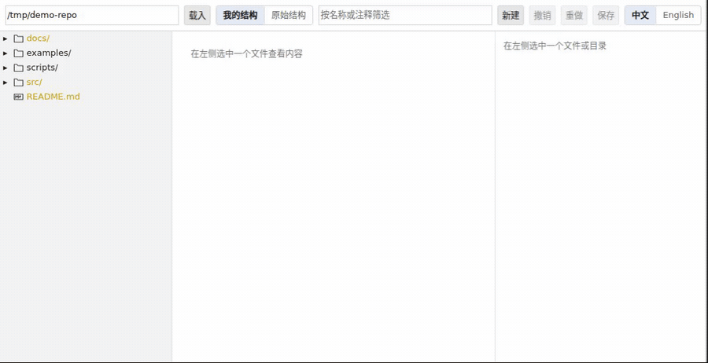
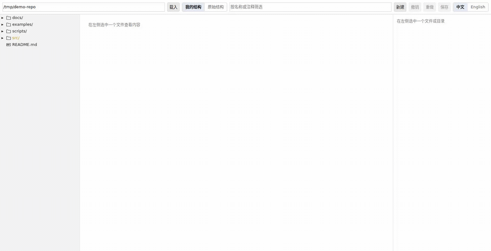
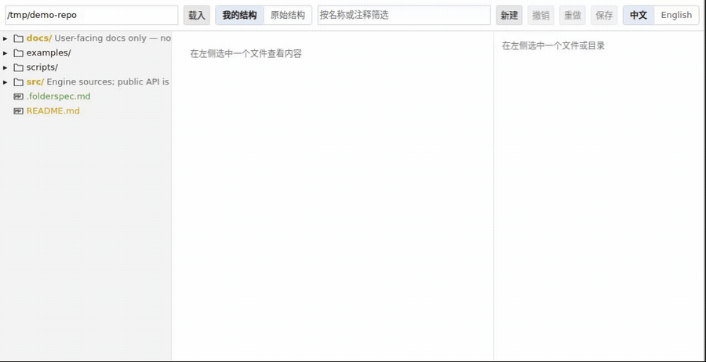

# FolderSpec

[English](README.md)

[](https://github.com/Litianyu141/FolderSpecForAgent/actions/workflows/ci.yml)
[](https://github.com/Litianyu141/FolderSpecForAgent/releases/latest)
[](LICENSE)
[](https://github.com/Litianyu141/FolderSpecForAgent/releases/latest)

一个仓库的结构意图——哪个目录负责什么、新东西该放哪儿——通常只存在于维护者脑子里。
人类接手陌生仓库时只能一个个目录点开看；AI Agent 新建文件时没有任何结构约束，久而久之
仓库越来越乱。

FolderSpec 让你用可视化的方式把这份意图声明出来，产出一个 `.folderspec.md` 文件：既能被人读，
也能被 Agent 遵守。**它是只读工具**——除了这一个文件，它不写磁盘上的任何东西，不执行
`mv` / `mkdir` / `rm`。真正改动仓库的是 Agent，FolderSpec 只负责把"应该长成什么样"说清楚。

---

## 看它怎么用

### 给目录写注释

单击任意文件或目录，右栏写注释、语义角色、约束强度。写过的节点在树上直接带出注释文字。



### 虚拟重排结构

右键声明一个尚不存在的目录，把东西拖进去——**磁盘一个字节都没动**。
切到「原始结构」视图即可对照：那才是磁盘的真实样子，你改的只是契约。



### 产出契约

`Shift` / `Ctrl` 多选一批节点，给它们写一条共享注释。保存后 `.folderspec.md` 就落在仓库根上——
**没有单独的"导出"步骤**，存储格式就是输出格式，那个文件本身就是给 Agent 读的产物。



---

## 安装与运行

### VSCode 扩展（推荐，也是分发给别人的方式）

从 [Releases](https://github.com/Litianyu141/FolderSpecForAgent/releases) 下载
`folderspec-vscode-<版本>.vsix`，然后任选一种装法：

```bash
code --install-extension folderspec-vscode-0.6.0.vsix
```

或者在 VSCode 里：`Ctrl+Shift+P` → **Extensions: Install from VSIX…** → 选那个文件。
装完重载窗口（`Developer: Reload Window`）即可。

> 尚未上架 VS Code 应用市场，所以搜不到，只能用 `.vsix` 安装；也因此**不会自动更新**，
> 换版本要重新下载安装一次。

### 命令行

**CLI 还没有发布到 npm**，`npx folderspec` 目前跑不通。要用的话从源码构建：

```bash
git clone https://github.com/Litianyu141/FolderSpecForAgent.git
cd FolderSpecForAgent
pnpm install && pnpm build
node packages/cli/dist/main.js            # 在当前目录打开
node packages/cli/dist/main.js ./some/dir # 在指定目录打开
```

它会起一个只监听 `127.0.0.1` 的本地服务，并尽量用 Chrome / Edge / Chromium 的
`--app` 模式开一个无边框窗口。只装了 Firefox 之类不支持 `--app` 的系统上，会退回成在默认
浏览器里开一个普通标签页，并在终端里打印地址。

| 参数 | 说明 |
|---|---|
| `[目录]` | 工作区路径，默认为当前目录 |
| `--port <n>` | 指定端口，默认随机取一个可用端口 |
| `--no-open` | 只起服务，不自动开窗口 |
| `--help` | 显示帮助 |

进程退出（Ctrl+C）时服务随之关闭。每次启动会生成一个一次性令牌注入到页面里，WebSocket
连接必须带上它——浏览器不对 WebSocket 施加同源策略，没有这一层的话，你在 folderspec 运行
期间打开的任何一个网页都能连上这个本地端口。

### VSCode 扩展怎么用

装好之后，**打开任意 `.folderspec.md` 文件**就会进入 FolderSpec 的可视化编辑器，而不是
纯文本视图。想看原始文本时用"打开方式 → 文本编辑器"。

命令面板里还有一条 `FolderSpec：打开结构契约`：当前工作区没有 `.folderspec.md` 时它会问你
要不要创建一个，然后直接打开。

保存走的是 VSCode 的 `WorkspaceEdit`，所以脏标记、`Ctrl+S`、撤销栈都正常工作。

### 让 Agent 读到它

存储格式就是输出格式，没有单独的"导出"步骤。在 `CLAUDE.md` / `AGENTS.md` 里加一行引用即可：

```markdown
@.folderspec.md
```

Agent 每次都会自动读到这份契约，零额外操作。

---

## 交互

**三栏布局**：左边是仓库树，中间是选中文件的只读预览（带行号、逐行语法高亮），右边是常驻的
注释 / 分组面板。

单击一个节点：树上高亮它，中间栏展示它的内容（目录则展示子项统计），右侧面板出现这一个
节点的注释编辑器，可以写注释、role、template 和 severity。

**Shift / Ctrl（macOS 上是 ⌘）点选可以扩选多个节点**：Shift 是从上一个锚点连续选取一个区间，
Ctrl/⌘ 是逐个增减。选中 ≥2 项时，右侧面板切换成**分组编辑**：给这一批写一条共享注释，落进
`.folderspec.md` 的 `## 分组` 区（字段与示例见下）。

**批量注释与单节点注释互不覆盖**：分组共享的是 `Group.text`，挂在分组本身，不会改动每个成员
各自的 `SpecNode.annotation`；反过来单独给某个成员写注释，也不会动它所属分组的共享文本。一个
节点可以同时拥有自己的注释、又属于一个或多个分组——树上用节点名后的圆点标出它所属的每个分组，
点击圆点即可跳转到该分组、把选中集切换成它的全部成员。

拖拽节点表示"它应该在那儿"——**这不会移动磁盘上的任何文件**，只是改变契约里声明的位置，剩下
的交给 Agent 去做。

**右键菜单**给出四组只作用于契约的操作，名字里的「仅契约」是认真的——它们都不碰磁盘：

- **新建目录 / 新建文件（仅契约）**：声明"这里应该有个 X"。右键点在目录上就建在它下面，
  点在空白处（或用顶栏的「新建」）就建在工作区根下；点在文件上则建在它的父目录下。
  典型用途是给 Agent 铺一棵目录模板——`templates/cases/fixtures/` 这样的结构可以整棵先声明
  出来，磁盘上一个目录都还不存在。名字必须在创建时输入（契约里没有"先建后改名"这条路）。
- **重命名（仅契约）**：改的是契约里那句"它应该叫什么"，磁盘上的文件名纹丝不动。
  子树与分组成员的路径会跟着一起重写。
- **取消声明**：把一个节点从契约里去掉。对磁盘上真实存在的节点而言，它**依旧留在树上**，
  只是不再带任何标注；只有 spec-only 节点（磁盘上没有的）才会整行消失。
  若它的子树里还有带注释的后代，会**拒绝**并要求你先逐个处理——一次点击丢掉多条已写下的
  声明，正是这个工具最该防的事。
- **复制 / 粘贴（仅契约）**：把一棵标注好的子树在别处再声明一份，典型用途是
  `templates/case-skeleton/` 粘到 `src/cases/` 下。落点与「新建」同一条规则（右键目录 →
  粘进它下面，右键文件 → 粘进它的父目录，右键空白 → 工作区根）。三件事值得先知道：
  - **复制的是契约子树，不是磁盘子树。** 右键一个从没被标注过的目录再粘贴，得到的是一条
    空声明（"那儿也该有个这样的东西"），**里面的东西不会跟着来**——它们本来就不在契约里。
    契约是稀疏覆盖层，不是仓库镜像；实时结构由磁盘扫描提供。这不是缺陷。
  - **撞名自动加后缀**：`demo` → `demo-copy` → `demo-copy-2`，文件的后缀加在扩展名之前
    （`a.ts` → `a-copy.ts`）。契约侧兄弟、磁盘侧兄弟都会让开，所以副本永远不会和别的东西
    合成一行、把注释揉到一起。
  - **副本不进任何分组。** 想让它入组，选中它再加。
  - 「复制」本身是纯读，只读态（解析失败 /「原始结构」视图）下照样能用；「粘贴」是写，
    只读态下禁用。

**撤销 / 重做**覆盖每一笔编辑（注释、拖拽、新建、重命名、粘贴、取消声明、分组、切换语言）。
它只作用于内存里的契约，**一个字节都不写磁盘**——所以它防的不是"操作把仓库弄坏了"，
而是"我拖错地方了"。

**「原始结构 / 我的结构」切换**：前者只按磁盘扫描结果显示、忽略契约里的结构性调整，
用来对照自己到底改了什么。原始结构视图下所有编辑入口都是禁用的。

**双语（中 / 英）**：右上角的开关同时切换操作界面的文案与契约里我们生成的样板文字
（标题行、导言、四个章节标题），并把 `lang` 写进 front-matter。
**你写的内容一个字都不动**——节点注释、分组说明、规则文字、模板描述、语义角色、路径，
全部保留原语言。只有逐字等于切换前那个语言默认值的标题/导言才会跟着换，你改过的一律不碰。

树上带 git 状态着色（忽略 / 未跟踪 / 已修改等）。**目录取整棵子树的聚合状态**——
里面有改动，目录名就跟着变色，和 VSCode 资源管理器一致；优先级是
`冲突 > 删除 > 修改 > 新增 > 未跟踪`，被忽略不参与聚合。
首屏只扫两层，展开时才按需扫子目录，所以开窗时间与仓库规模基本无关。

在 VSCode 里，界面配色、字体、语法高亮的取色全部跟随当前主题（通过 webview 暴露的
`--vscode-*` 变量映射）；CLI 宿主拿不到这些变量，用的是一套自洽的浅色兜底值。

---

## `.folderspec.md` 的格式

一个文件，分三区，各用各的强项：结构树用 Markdown 嵌套列表（LLM 见得最多、token 最省、
GitHub 直接渲染），模板和规则用内嵌 YAML 块（它们是结构化定义，塞进树里会别扭）。

### 骨架

````markdown
---
folderspec: 1
root: .
ownership: human
---

# 仓库结构契约

> 本文件声明本仓库的**结构意图**，是长期不变量，不是一次性操作指令。
> Agent 应读取本文件、对照实际仓库、自行决定如何变更磁盘。
> Agent 不应自行修改本文件；若认为规则不合理，请向人类提出修改建议。

## 结构
...

## 模板
...

## 规则
...

## 分组
...
````

front-matter 里 `folderspec` 必须是 `1`。`## 结构` 区必须存在，`## 模板`、`## 规则`、`## 分组`
都可以省略。区块标题也接受英文别名 `## Structure` / `## Templates` / `## Rules` / `## Groups`。

### 结构区的行语法

一行 = 一个节点：

```
<缩进><"- "><`名称`>[ <`[标签]`>]*[ " — " <注释文本>]
```

| 元素 | 规则 |
|---|---|
| 缩进 | 2 个空格 = 1 层。必须是 2 的倍数，且不得跳级 |
| 名称 | **反引号包裹**。末尾带 `/` 表示目录，否则是文件 |
| 占位符 | 名称里的 `{xxx}` 是模板变量，例如 `` `{case-name}/` `` |
| 标签 | 反引号包裹的 `` `[key:value]` ``，可以有多个，之间用空格分隔 |
| 注释 | ` — `（**空格 + U+2014 长破折号 + 空格**）之后的全部内容。首次出现的分隔符生效 |

三个已定义的标签：

| 标签 | 含义 |
|---|---|
| `` `[role:<name>]` `` | 语义角色，让 Agent 理解"这是什么"而非仅"叫什么" |
| `` `[template:<name>]` `` | 该节点适用模板区中定义的同名模板 |
| `` `[severity:error\|warning\|advisory]` `` | 该节点注释的约束强度，缺省为 `advisory`（纯知识） |

例子：

```markdown
## 结构

- `src/` `[role:source-root]` — 核心源码
  - `core/` `[role:core-engine]` `[severity:error]` — 核心业务逻辑，禁止依赖 UI
  - `ui/` `[role:frontend]` — 所有界面代码
  - `cases/` `[role:case-root]` — 每个独立案例一个目录
    - `{case-name}/` `[template:case]` — 案例目录
- `tests/` `[role:test-root]` — 自动化测试
- `docs/`
  - `specs/` — 设计文档放这里
```

这是一层**稀疏覆盖层**：只需要写被标注过的节点及其父级链条，不是整个仓库的镜像。完整结构
由实时扫描提供，不用也不该持久化。

同一层里不允许出现两个同名节点——那是重复声明，解析器会直接报错并给出行号。

### 模板区

模板和规则在 MVP 里**只能手写 YAML**（可视化编辑器是二期功能），所以这里给出完整的字段说明。

顶层是一个映射：模板名 → 定义。

| 字段 | 类型 | 必填 | 说明 |
|---|---|---|---|
| `description` | 字符串 | 否 | 这个模板是什么 |
| `root` | 映射 | 否 | 只允许 `variable` / `naming` 两个键，都是字符串 |
| `root.variable` | 字符串 | 否 | 目录名里的变量名，对应结构区的 `{case-name}` |
| `root.naming` | 字符串 | 否 | 命名风格约定，例如 `kebab-case`（MVP 只记录，不校验） |
| `children` | 映射 | 否 | 子项名 → 子项定义。**键末尾带 `/` 表示目录** |
| `children.<名>.required` | 布尔 | **是** | 只能是 `true` 或 `false`，缺了会报错 |
| `children.<名>.role` | 字符串 | 否 | 该子项的语义角色 |
| `exemplar` | 字符串数组 | 否 | 指向仓库里的真实参考实现，让 Agent 自己去读 |

除上表以外的字段一律报错，不会被静默忽略。

````markdown
## 模板

```yaml
case:
  description: 一个能独立运行和验证的案例
  root:
    variable: case-name
    naming: kebab-case
  children:
    README.md:
      role: case-documentation
      required: true
    input/:
      role: source-input
      required: true
    expected/:
      role: expected-output
      required: true
    test.py:
      role: test-entrypoint
      required: true
    NOTES.md:
      required: false
  exemplar:
    - src/cases/basic-login
```
````

`exemplar` 是这里性价比最高的字段：它不把代码塞进 prompt，只给 Agent 一个指针，让它自己去读
真实实现、学那个仓库的习惯。

### 规则区

顶层是一个序列，每条规则一个 `-` 项。

| 字段 | 类型 | 必填 | 说明 |
|---|---|---|---|
| `id` | 非空字符串 | **是** | 全文唯一，重复会报错 |
| `severity` | `error` / `warning` / `advisory` | **是** | 这条规则的强制程度 |
| `scope` | 非空字符串 | **是** | glob 表达式，划定规则适用范围 |
| `text` | 非空字符串 | **是** | 写给人和 Agent 看的规则正文 |

同样，除上表以外的字段一律报错。

````markdown
## 规则

```yaml
- id: case-location
  severity: error
  scope: "**"
  text: 所有新案例必须作为独立目录创建在 src/cases 下

- id: no-ui-in-core
  severity: error
  scope: "src/core/**"
  text: core 不得 import ui 层任何模块

- id: case-size
  severity: warning
  scope: "src/cases/*"
  text: 单个 case 直接子文件不宜超过 10 个
```
````

### 分组区

分组表示"这些节点应该被当成一批看待"——例如一组互相关联的配置文件、一批还没归位但已经知道
该一起处理的旧文件。分组**不表达父子层级**，成员可以来自树上任意位置，也**不需要**先在结构
区出现过。

顶层是一个序列，每个分组一个 `-` 项。

| 字段 | 类型 | 必填 | 说明 |
|---|---|---|---|
| `id` | 非空字符串 | **是** | 全文唯一，重复会报错。界面上留空会自动取名：取所有成员的最长公共父目录名，取不到就用 `group`，重名时追加 `-2`、`-3` |
| `members` | 字符串数组 | **是** | 至少一个成员；每个都是**工作区相对的 posix 路径**（`/` 分隔）。不接受绝对路径、`..` 路径段、反斜杠 |
| `text` | 非空字符串 | **是** | 这一批节点共享的注释。界面上把它清空等价于删除这个分组 |
| `severity` | `error` / `warning` / `advisory` | 否 | 缺省表示"仅注释，不强制" |

除上表以外的字段一律报错，不会被静默忽略。

````markdown
## 分组

```yaml
- id: legacy-configs
  members:
    - config/old-a.json
    - config/old-b.json
    - scripts/migrate-config.js
  text: 三个旧配置文件加迁移脚本，等 config/schema.ts 落地后整体删除
  severity: advisory

- id: db-migrations
  members:
    - src/db/migrations/0001_init.sql
    - src/db/migrations/0002_add_users.sql
  text: 按文件名顺序执行，不得重排或改名已发布的迁移文件
  severity: error
```
````

在界面上：选中多个节点（Shift 连续区间 / Ctrl 逐个增减）后，右侧面板会切换成分组编辑；分组名
留空则自动取名，注释是必填项——清空它等于删除整个分组。树上属于分组的节点，名字后面会带一个
圆点，点击即可把选中集切换成该分组的全部成员。

**编辑中成员集会锁定**：只要分组面板里有还没提交的编辑，这一批的成员就暂时不能增减——成员上的
`×` 置灰，树上的 Ctrl/Shift 改选与分组圆点也不再改动这一批。原因是"写给谁"这件事必须在你打字
期间保持不变：成员集一变，面板编辑的可能就是另一个分组了，那句话会落到它头上、把它原有的注释
覆盖掉。点输入框以外任意处即提交（提交落地后自动解锁）——**包括树上的节点**：那一下会先让输入框
失焦、把这次编辑提交出去，然后才把选中集换成你点的那个。**本工具没有"放弃编辑"的入口**，写入语义
自始至终是"失焦即提交"。

### 注释、规则、模板、范例的分工

| 概念 | 语义 | 对 Agent 的意义 |
|---|---|---|
| **Annotation**（注释） | "这个目录负责处理数据库迁移" | 知识，帮助理解，不强制 |
| **Rule**（规则） | "任何 migration 必须放这里" | 约束，必须遵守 |
| **Template**（模板） | "case 目录应包含这些子项" | 新建时的结构骨架 |
| **Exemplar**（范例） | "参考 `src/cases/basic-login`" | 指针，让 Agent 自己去读真实实现 |
| **Group**（分组） | "这几个节点是一批，一起看" | 知识，帮助理解；设置了 `severity` 时按对应强度处理 |

### 声明式，不是命令式

契约描述的是**长期不变量**（"case 应该在 src/cases 下"），不是**一次性操作**（"把 examples/foo
移到 src/cases/foo"）。操作记录一旦被执行就过期，契约从此携带一条谎言；不变量永不过期。

所以拖拽节点之后，文件里**不记录"从哪儿来"**。树上节点所在的位置就是它应该在的位置。

### 关于「Agent 不得修改契约」

没有任何技术机制能阻止 Agent 写文件，所以这里不引入 `agent_permissions` 之类的伪权限字段
（那只是自我安慰）。实际手段是两条：front-matter 里的 `ownership: human` 加正文里那句人类
可读的声明（LLM 会照做，这是有效的），以及这个文件进 git——任何契约变更都会出现在 diff 里，
走正常 code review。

---

## MVP 已知限制

这些是真实存在的限制，写在这里而不是假装它们不存在。

1. **嵌套 `.gitignore` 的覆盖范围**：扫描时逐目录组合 ignore 规则，但只覆盖到当前已扫描的
   深度。更深处的 `.gitignore` 要等该目录被展开时才生效。绝大多数场景无感，但不等价于 git
   的完整语义。
2. **位置差异不可跨会话检测**：重新加载后，工具无法知道契约里的 `src/cases/foo` 和磁盘上的
   `examples/foo` 是同一个东西——它只能看到"契约声明的路径在磁盘上不存在"和"磁盘上有个未
   标注的目录"。这是遵循声明式原则的代价。**它不影响主用途**：Agent 拿到"`src/cases/{case-name}/`
   应存在"加上"所有新案例必须在 src/cases 下"，自己扫一遍仓库就能判断该不该搬，而且它比工具
   更清楚搬动会牵连哪些 import、构建配置和测试。
3. **模板与规则只能手写 YAML**：没有可视化编辑器（见上面的完整字段说明）。
4. **没有确定性校验**：MVP 只产出契约，不检查仓库是否符合契约。没有 `folderspec validate`。
5. **不编译到 AGENTS.md / .cursor/rules**：靠在 `CLAUDE.md` / `AGENTS.md` 里写 `@.folderspec.md`
   引用，没有编译产物。
6. **不做增量刷新**：没有文件监听器。CLI 宿主**察觉不到**契约文件在外部被改动（比如被 Agent
   改写），需要手动重新载入。VSCode 宿主因为文档由编辑器托管，能提示外部变更。
7. **节点名不能含反引号或换行**：当前格式用反引号包裹节点名、一个节点占一整行，两者都无法
   转义。碰到 ``we`ird`` 这样合法但无法表示的目录名，工具会在标注时就明确拒绝并点名该路径，
   而不是写出一个读不回来的文件。完整转义是二期的事。
8. **VSCode 端到端测试从未在 CI 之外真正跑过**：`@vscode/test-electron` 冒烟测试需要图形环境，
   本地无 `DISPLAY` 时跑不了。
9. **文件图标是自带的，不跟随 VSCode 的 file icon theme**：VSCode 不把用户当前生效的图标主题
   暴露给 webview，所以树上的图标与原生资源管理器里看到的可能不一致。这不是实现瑕疵。
10. **中间栏的语法高亮是逐行进行的**：为了让行号绝对可靠（跨行高亮会导致换行被高亮器吞掉，
    行号与实际行错位），代价是跨行的字符串字面量、块注释染色不完美——比如一段跨三行的
    `/* ... */` 注释，中间那行看不出自己身处注释内。这是刻意的取舍，不是待修的 bug。
11. **分组成员若既不在结构区、又不在磁盘上，树上不会出现对应的行**（因此看不到它的分组色点）。
    这种情况只在"一个从未被单独注释过的文件被加进分组、随后从磁盘删除"时出现。**该成员不会
    丢失**——它仍在 `.folderspec.md` 的分组区里，也仍会列在分组面板的成员列表中；只是树上没有
    可挂载的节点。树只渲染结构区声明过的节点与磁盘上真实存在的节点，为分组成员额外合成节点会
    破坏"稀疏覆盖层"这条不变量。

---

## 开发

前置：Node ≥ 20、pnpm。

```bash
pnpm install
pnpm typecheck      # 会先构建 core，其余包依赖它的 .d.ts
pnpm -r test
pnpm -r build
```

四个包：

| 包 | 职责 |
|---|---|
| `@folderspec/core` | 纯逻辑：解析、序列化、扫描、git 状态、merge，以及宿主无关的 `Session` |
| `@folderspec/ui` | React SPA，只通过 `Bridge` 抽象和宿主对话，对宿主一无所知 |
| `folderspec` | CLI 宿主：HTTP + WebSocket + 无边框浏览器窗口 |
| `folderspec-vscode` | VSCode 宿主：`CustomTextEditorProvider` |

**`@folderspec/core` 必须先构建**，其他包的 typecheck 才能通过（`pnpm typecheck` 已经包含这一步）。

VSCode 的端到端冒烟测试单独跑，需要图形环境：

```bash
pnpm -C packages/vscode test:e2e
```

### 两条不变量

- **每一次写盘之前都先自校验**：`serialize → parse` 走一遍，读不回来就中止写入。这道闸门在
  `Session.raw()` 上，所以直接落盘的 CLI 和走 `WorkspaceEdit` 的 VSCode 都受它保护。
- **绝不用空契约覆盖用户的文件**：契约文件解析失败、或者存在但读不出来（权限、被别的进程
  占用……），会话一律进入只读模式并显示原因，而不是当成"没有文件"从头开始。
